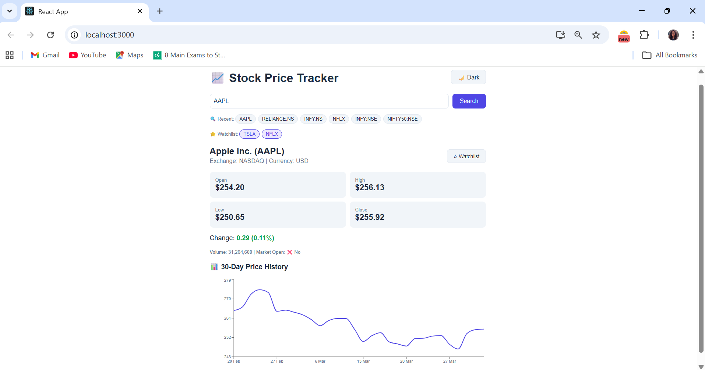
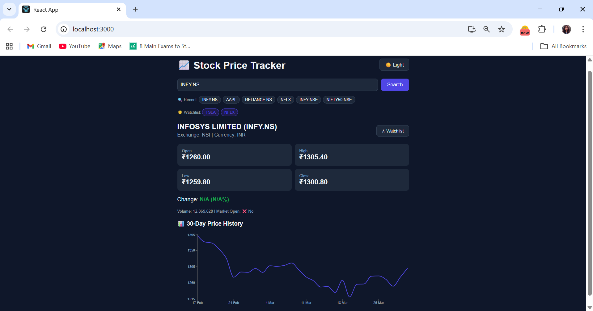

# 📈 Stock Price Tracker

A full stack web application that provides real-time stock market data for both US and Indian stocks with a clean, modern UI.

## 🚀 Live Demo
Coming soon!

## 🛠️ Tech Stack

| Layer | Technology |
|---|---|
| Frontend | React, Recharts, Axios |
| Backend | Java Spring Boot |
| Stock Data | Twelve Data API + Yahoo Finance API |
| Version Control | Git & GitHub |

## ✨ Features

- 🔍 Real-time stock price lookup for any ticker symbol
- 🇺🇸 US Stocks (AAPL, TSLA, NVDA, META...)
- 🇮🇳 Indian Stocks (RELIANCE.NS, TCS.NS, INFY.NS...)
- 📊 30-day historical price chart
- ⭐ Watchlist to save favourite stocks
- 🕐 Recent search history
- 🌙 Dark mode / Light mode toggle
- 💱 Automatic ₹/$ currency detection

## 📸 Screenshots

### US Stocks (Light Mode)


### Indian Stocks (INR Currency)


## 🚀 How to Run Locally

### Prerequisites
- Java JDK 17+
- Maven
- Node.js & npm
- Free API key from [Twelve Data](https://twelvedata.com)

### Backend
```bash
cd backend
mvn spring-boot:run
```

### Frontend
```bash
cd frontend
npm install
npm start
```

Open your browser at `http://localhost:3000`

## 📊 Example Stocks to Search

| Company | Ticker |
|---|---|
| Apple | AAPL |
| Tesla | TSLA |
| Reliance | RELIANCE.NS |
| TCS | TCS.NS |
| Infosys | INFY.NS |

## 🔮 Future Improvements
- [ ] User authentication
- [ ] Persistent database (MySQL)
- [ ] Cloud deployment
- [ ] Price alerts & notifications
- [ ] Portfolio tracker

## 👩‍💻 Author
**Hrishitha Prasad**
- GitHub: [@Hrishithaprasad](https://github.com/Hrishithaprasad)
- LinkedIn: [hrishithaprasad](https://linkedin.com/in/hrishithaprasad)
